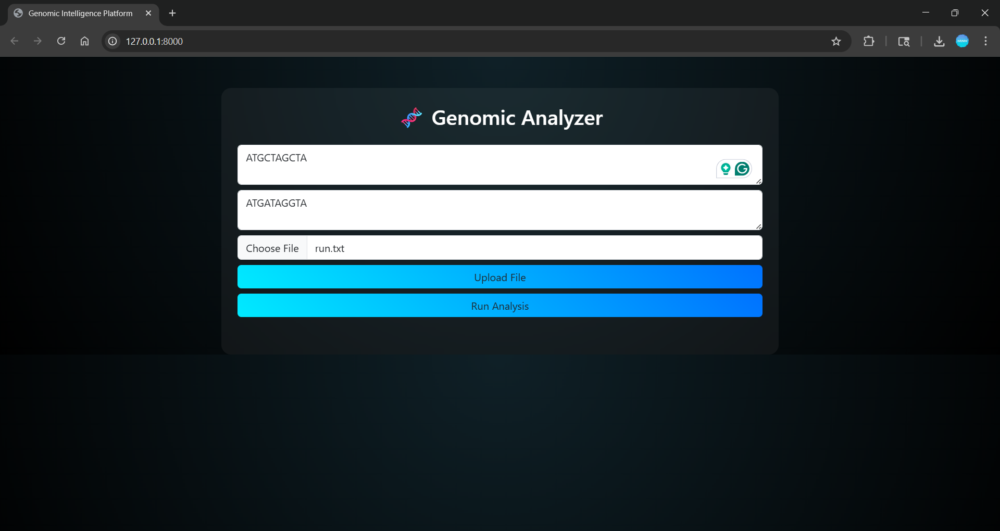
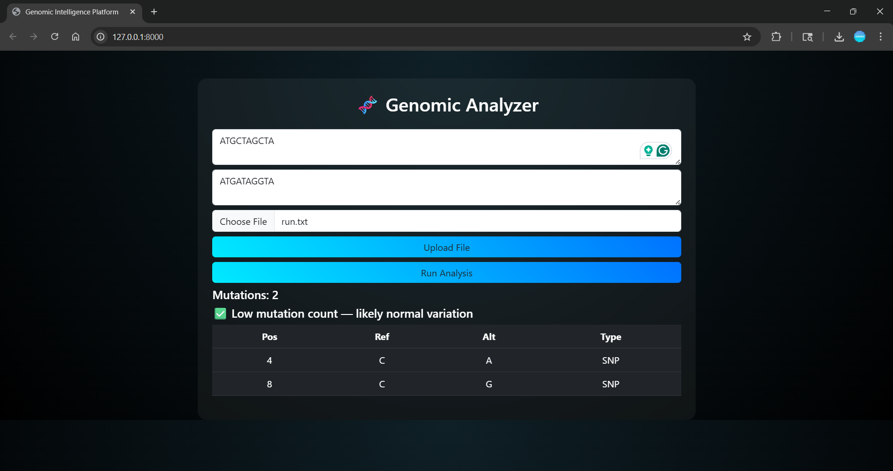

# 🧬 Genomic Analyzer

A web-based tool to detect and visualize DNA mutations (SNPs) between sequences.

---

## 🚀 Features

* Detects SNP mutations between DNA sequences
* Interactive visualization using Plotly
* Upload DNA sequence files
* Simple AI-based interpretation

---

## 🛠️ Tech Stack

* Python
* Flask
* Plotly
* HTML/CSS

---

## ⚙️ How to Run

```bash
pip install -r requirements.txt
python app.py
```

Open in browser:

```
http://127.0.0.1:8000
```

---

## 📸 Preview
### 🏠 Home Page


### 🧬 Input DNA Sequences


### ⏳ Processing


### 📊 Results


## 👨‍💻 Author

* Naman Arora
* Deepak Kr. Gupta
* Tushar Kr. Karn
